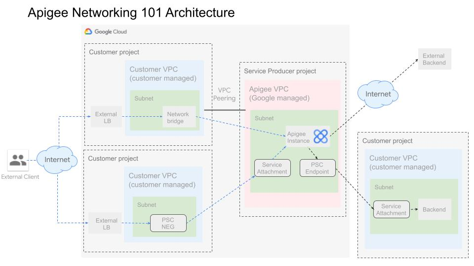

# apigee-networking-101
This includes deployment scripts for an Apigee PayG org with various methods of internal &amp; external networking enabled



## Notes
* The intent of this repo is to create a fixed environment for learning and demonstration, **not production**.
* The Terraform script sets the Google Cloud org policy constraints/compute.requireShieldedVm to false at the project level, so the script may fail in highly regulated environments.
* The actions taken by deploying this repo will add cost. To minimize costs, instructions are provided for how to teardown the demo environment. For more on cost, please refer to Google Cloud public pricing pages for components such as ApigeeX, External Load Balancers, Private Service Connect, Reserved Public IP Addresses, Data Transfer, Certificate Manager and Key Management Service. 

## Prerequisites

1. Full access to deploy an Apigee organization & it's networking components
2. Access to deploy API proxies on Apigee
3. Make sure the following tools are available in your terminal's $PATH (Cloud Shell has these preconfigured)
    * [gcloud SDK](https://cloud.google.com/sdk/docs/install)
    * unzip
    * curl
    * terraform

## Setup instructions

1. Clone the this repo to your machine

```sh
git clone https://github.com/apigeek3000/apigee-networking-101.git
```

2. Ensure you have an active GCP account selected to run gcloud commands with [gcloud CLI](https://cloud.google.com/sdk/docs/install) (not needed in Cloud Shell).

```sh
gcloud auth login
gcloud auth application-default login
```


## Deploy Apigee & Networking Components

To deploy networking components together with Apigee (all but the API Proxy which cannot be automated by Terraform), follow this process:
1. Create a project in GCP, if not already created. Reference if needed [Creating and managing projects](https://cloud.google.com/resource-manager/docs/creating-managing-projects)
2. Make a copy of the example.tfvars file and rename it to terraform.tfvars
3. In terraform.tfvars, add the value for the project ID. All other values can stay the same unless customization required, eg choosing a different region. Reference if needed for how to find project ID, see [Find the project name, number, and ID](https://cloud.google.com/resource-manager/docs/creating-managing-projects#identifying_projects)
4. At the command prompt where you'll run the script, in the Terraform directory, run:

```sh 
terraform init
terraform plan
terraform apply -auto-approve
```

4. Wait ~35-40 minutes for the script to complete. You'll see a message similar to "Apply complete!" and then move to the next section.

### Apigee Terraform Supplemental

You can find more Terraform solutions for Apigee X at the [Apigee Github](https://github.com/apigee/terraform-modules)


## Deploy & Test Apigee components

Next, let's deploy our hello-user proxy:

1. In the `scripts` directory, copy the `example.sh` file, rename the new file to `env.sh`, and configure the ENV vars. Delete the relevant var line item if mig_nb, psc_nb, or psc_sb_mig is configured to false
* `PROJECT` the project where your Apigee organization is located. Find GCP Project ID in Project Settings
* `APIGEE_HOST` the externally reachable hostname of the load balancer which routes northbound to Apigee via VPC peering (mig_nb). Find the Apigee Env Group hostname associated with the lb-nb-apigee-mig load balancer
* `APIGEE_PSC_HOST` the externally reachable hostname of the load balancer which routes northbound to Apigee via PSC (psc_nb). Find the Apigee Env Group hostname associated with the lb-nb-apigee-pscneg load balancer
* `APIGEE_ENV` the Apigee environment where the demo resources should be created. Find in Apigee Environments
* `PSC_DOMAIN` the internally reachable hostname of the PSC endpoint which routes southbound from Apigee to a private backend service (psc_sb_mig). Find in Apigee Endpoint Attachments (host column)

Now from the `scripts` directory, source the `env.sh` file

```sh
source ./env.sh
```

2. Next run the following command to deploy the proxy:

```sh
./deploy/deploy-hello-user.sh
```

3. You now have two different external load balancers routing northbound to Apigee via either VPC Peering or PSC Endpoints. Both of these load balancers are capable of routing southbound through Apigee to either private or external backend endpoints. Follow the URLs output by the deployment script to test your proxies. If there's an error, it is likely that not enough time has passed for the load balancer certs to go ACTIVE. See the Network Debugging section below.


## Network Debugging

Note: It can take 24 hours for the certificate to move to Status of ACTIVE. From testing, it is usually much faster, less than 1 hour. If you see Statuses such as FAILED_NOT_VISIBLE or PROVISIONING, the certificate needs more time to validate. See [Domain status](https://cloud.google.com/load-balancing/docs/ssl-certificates/troubleshooting#domain-status) for more information. 

Go to Network Services > Load Balancing and select your apigee load balancer(s). In the Frontend section, click the link under the heading "Certificate". Verify that the cert in the load balancer is Status of ACTIVE. See images in Step 4 of [Validated TLS Cert Made Simpler: Testing Google Cloud External Load Balancers Without Owning a Domain](https://medium.com/google-cloud/validated-tls-cert-made-simpler-testing-google-cloud-external-load-balancers-without-owning-a-d5a972bac3b2) for how an ACTIVE cert should look. Once it is active, find the domain which is based on a public IP address created in the script. It will be in the form of #-#-#-#.nip.io. 


## Conclusion & Cleanup

Congratulations! You've successfully deployed a pay-as-you-go Apigee organization complete with both VPC peering and PSC for securing connections.

To delete the Apigee artifact (hello-user proxy) created, from the `scripts` directory run the following commands:

```sh
source ./env.sh
./clean-up/clean-up-hello-user.sh
```

To delete the Apigee infrastructure (Apigee + networking) created, from the `terraform` directory run the following command:

```sh
terraform destroy -auto-approve
```

Wait ~15-25 minutes for the components created by the Terraform script to be removed. You'll see a message similar to "Destroy complete!" 
